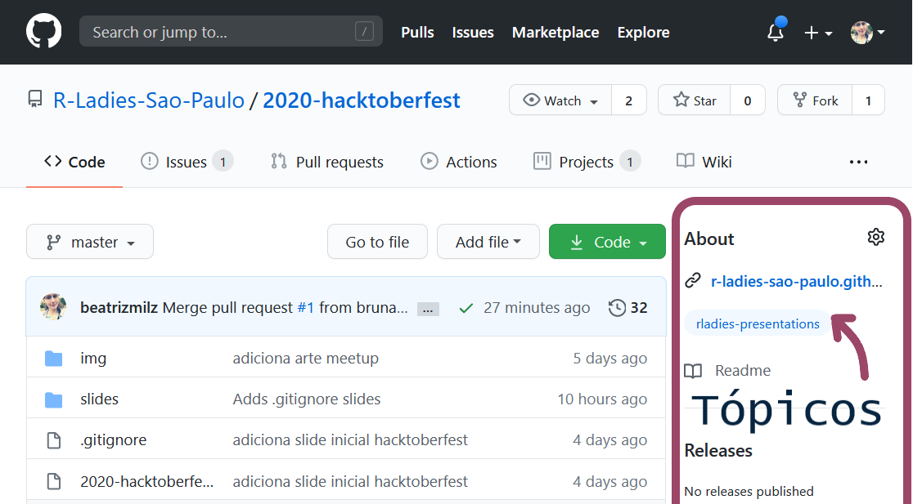
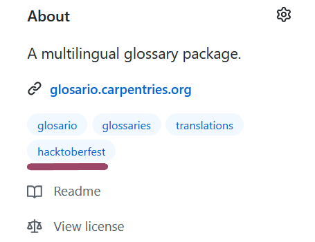
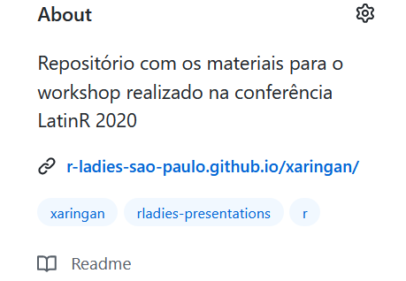
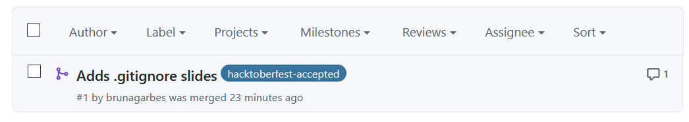
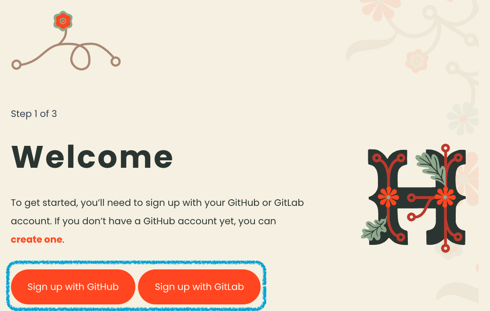
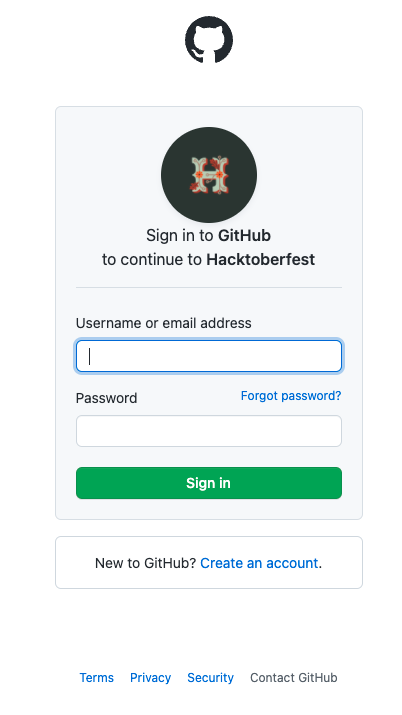
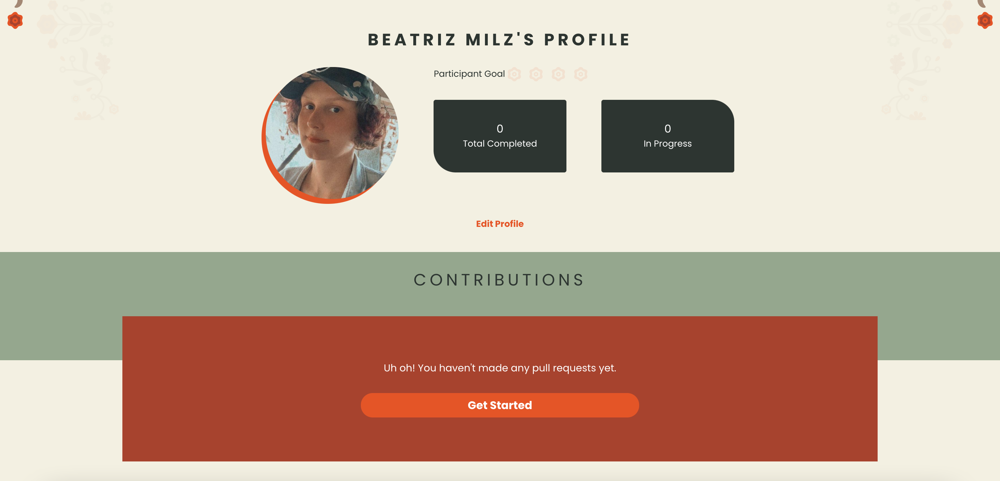
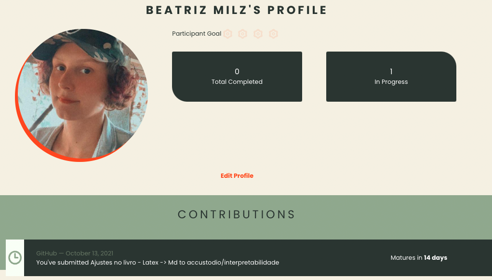

```{r metathis, echo=FALSE}
# library(metathis)
# meta() %>%
#   meta_name("github-repo" = "R-Ladies-Sao-Paulo/2020-hacktoberfest") %>% 
#   meta_social(
#     title = "Hacktoberfest 2020 + R-Ladies São Paulo",
#     description = paste(
#       "Apresentação sobre ",
#       "como participar da Hacktoberfest 2020."
#     ),
#     url = "https://r-ladies-sao-paulo.github.io/2020-hacktoberfest/slides/hacktoberfest/",
#     image = "https://r-ladies-sao-paulo.github.io/2020-hacktoberfest/slides/hacktoberfest/img/share-card.png",
#     image_alt = paste(
#       "Primeiro slide da apresentação sobre ",
#       "como participar da Hacktoberfest 2020.",
#       "Apresentado por Angélica Custódio."
#     ),
#     og_type = "website",
#     og_author = c("Beatriz Milz", "Angélica Custódio"),
#     twitter_card_type = "summary_large_image",
#     twitter_creator = c("@beamilz", "@angcustodio")
#   )
```

```{r eval=FALSE, include=FALSE}
#devtools::install_github("hadley/emo", dependencies = TRUE)
#install.packages("sysfonts")
#install.packages("showtext")
#install.packages("xaringan")
#install.packages("xaringanthemer")
#install.packages("metathis")
#devtools::install_github("gadenbuie/xaringanExtra")
```

```{r setup, include=FALSE}
options(htmltools.dir.version = FALSE)
```

```{r xaringan-themer, include=FALSE, warning=FALSE}
library(xaringanthemer)
style_duo_accent(
  primary_color = "#F74700",
  secondary_color = "#677662",
  inverse_header_color = "#f4f0e1",
  background_color = "#f4f0e1",
  title_slide_background_color = "#f4f0e1",
  title_slide_text_color = "#677662",
  link_color = "#F74700"
)
```

```{r xaringanExtra, echo=FALSE}
xaringanExtra::use_logo(
  image_url = "img/Icon.png",
  link_url = "https://r-ladies-sao-paulo.github.io/2020-hacktoberfest/")

```

## Apresentação derivada de: 

```{r echo=FALSE, out.width="70%", fig.align='center'}
knitr::include_graphics("https://r-ladies-sao-paulo.github.io/2020-hacktoberfest/img/arte_meetup.png")
```

https://r-ladies-sao-paulo.github.io/2020-hacktoberfest/

---

## O que é a **Hacktoberfest**?

- É uma celebração do __open source__ que ocorre em outubro.

- A **Hacktoberfest** é aberta para todes!

- Pessoas fazem contribuições em projetos abertos.

- Caso faça contribuições válidas (de acordo com as regras), pode ganhar uma camiseta e adesivos `r emo::ji("shirt")` OU pode escolher a opção de plantar uma árvore.


---

## Regras para receber o prêmio

- Necessário realizar 4 **contribuições válidas**, através de __Pull Requests__ no [GitHub](https://github.com).

> Pull Requests = PR = a forma que enviamos contribuições nos repositórios :)

- Para ser uma contribuição válida:

  - Precisa ser submetida durante o mês de outubro
  
  - Para repositórios __com ou sem__ o tópico `Hacktoberfest`: A pessoa mantenedora do repositório precisa adicionar uma label/rótulo de `hacktoberfest-accepted` no Pull Request
  
  - Para repositórios __com__ o tópico `Hacktoberfest`: PR é aprovado ou merged

Saiba mais em: https://hacktoberfest.digitalocean.com/resources/participation


---
class: middle

## Repositórios podem ter tópicos. 

Exemplo:

```{r echo=FALSE, fig.align='center', out.width="70%"}

```

---
class: middle

## Exemplos de repositórios

.pull-left[
### __Com__ tópico Hacktoberfest

```{r echo=FALSE, fig.align='center', out.width="70%"}

```

[carpentries/glosario](https://github.com/carpentries/glosario)
]

.pull-right[
### __Sem__ tópico Hacktoberfest

```{r echo=FALSE, fig.align='center', out.width="80%"}

```

[R-Ladies-Sao-Paulo/xaringan](https://github.com/R-Ladies-Sao-Paulo/xaringan)
]


---
class: middle

## Pull Requests (PRs) podem ter labels

Exemplo de Pull Request com label/rótulo de `hacktoberfest-accepted`:

```{r echo=FALSE, fig.align='center', out.width="70%"}

```


---
## Como participar?

- No site da __Hacktoberfest__, [faça o login com o GitHub e/ou GitLab](https://hacktoberfest.digitalocean.com/register)


```{r echo=FALSE, fig.align='center', out.width="60%"}

```

---

## Como participar?

.pull-left[


- Dê permissão utilizando sua conta do GitHub
]

.pull-right[

```{r echo=FALSE, fig.align='center', out.width="50%"}

```
]

---
## Como participar?

- [Nesta página](https://hacktoberfest.digitalocean.com/profile) ficarão listados as suas contribuções, com uma legenda sobre o status da sua contribuição. Enquanto não houver contribuições válidas, a página ficará assim:

```{r echo=FALSE, fig.align='center', out.width="80%"}

```


---

## Contribuições

```{r echo=FALSE, fig.align='center', out.width="80%"}

```

---

## Legenda

-  __In progress__: Seu PR foi aceito por uma pessoa mantenedora e atualmente está dentro do período de revisão, que dura quatorze dias. 

-  __Completed__: Parabéns! Seu PR passou no período de revisão e conta para a conclusão do desafio da Hacktoberfest!

---

## Repositórios para contribuir

- Da Curso-R: 

  - [munifacil](https://github.com/curso-r/munifacil)
  - [Livro Ciência de Dados em R](https://github.com/curso-r/livro-material) - [Veja o livro aqui!](https://livro.curso-r.com/)
  - [auth0](https://github.com/curso-r/auth0)
  - [torchaudio](https://github.com/curso-r/torchaudio)
  
- Outros repositórios:

  - [Materiais de estudo de R](https://github.com/beatrizmilz/materiais_estudo_R) - [Veja a página aqui](https://materiais-estudo-r.netlify.app/)
  - [Capítulos da R-Ladies no Brasil](https://github.com/R-Ladies-Sao-Paulo/RLadies-Brasil) - [Arquivo `data-raw/capitulos_redes.R`](https://github.com/R-Ladies-Sao-Paulo/RLadies-Brasil/blob/master/data-raw/capitulos_redes.R)
  - [microdatasus](https://github.com/rfsaldanha/microdatasus)
  - [Base dos Dados](https://github.com/basedosdados/mais/#usando-em-r)
  
  


---
class: inverse, center, middle

## Bom evento! `r emo::ji("woman_technologist")`


Caso tenha dúvidas, veja as [perguntas frequentes](https://hacktoberfest.digitalocean.com/faq)!


Apresentação feita com <i class="fab fa-r-project"></i> e os pacotes [xaringan](https://github.com/yihui/xaringan) + [xaringanthemer](https://pkg.garrickadenbuie.com/xaringanthemer/) e [xaringanExtra](https://pkg.garrickadenbuie.com/xaringanExtra/), por:

Agradecimentos:  Beatriz Milz  <a href='https://twitter.com/BeaMilz'  target="_blank"><i class="fab fa-twitter"></i></a> , Angélica Custódio <a href='https://twitter.com/angcustodio'  target="_blank"><i class="fab fa-twitter"></i></a>, Jean Prado
<a href='https://twitter.com/jeangprado'  target="_blank"><i class="fab fa-twitter"></i></a>


  
<!-- inicio font awesome -->
<script src="https://kit.fontawesome.com/1f72d6921a.js" crossorigin="anonymous"></script>
<!-- final font awesome -->

<link rel="stylesheet" href="https://cdn.jsdelivr.net/gh/jpswalsh/academicons@1/css/academicons.min.css">

